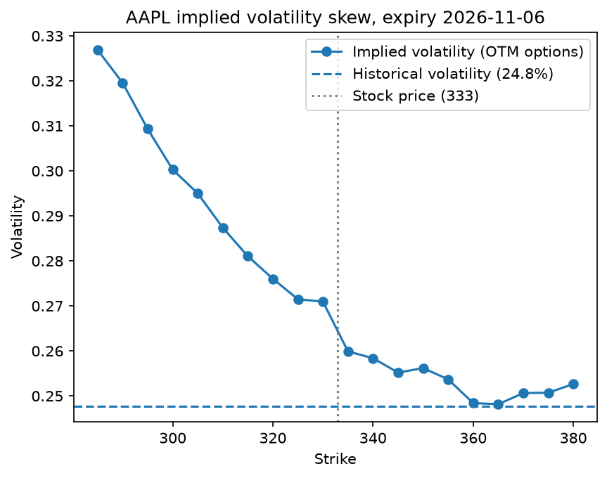

# Options Pricing Model

A Python project that prices stock options with Black-Scholes and Monte Carlo simulation, compares the results to live market prices for Apple (AAPL), and backs out implied volatility to show where the market disagrees with the model.



## What it does

1. **Black-Scholes pricer** (`black_scholes.py`): prices European calls and puts, with a put-call parity check to confirm the call and put prices are consistent.
2. **Market data** (`get_options.py`, `market_inputs.py`): pulls the AAPL option chain for the first expiry at least 30 days out, plus the inputs the model needs: time to expiry, the 13-week U.S. T-bill rate as the risk-free rate, and one year of historical volatility from daily log returns.
3. **Model vs. market** (`compare.py`): prices each call with historical volatility and compares it to the market bid-ask midpoint.
4. **Monte Carlo pricer** (`monte_carlo.py`): simulates stock prices at expiry under risk-neutral pricing and reports a 95% confidence interval for each estimate.
5. **Implied volatility** (`implied_vol.py`): solves for the volatility that makes Black-Scholes match each market price using the bisection method, then plots it across strikes.

## Findings

Data pulled October 6, 2026, for the November 6, 2026 expiry.

- **The model priced every call below the market.** Using historical volatility (24.8%), Black-Scholes came in under the market midpoint at every strike. In percentage terms, the gap was largest for out-of-the-money calls.
- **The market is pricing in more volatility than the past year shows.** Implied volatility sits above historical volatility across nearly the whole curve.
- **Implied volatility is not flat. It skews.** It falls from about 33% at the 285 strike to about 25% near the 360 strike. Black-Scholes assumes one volatility for every strike, so this skew is the market pricing in a higher chance of large drops than the model allows.
- **Monte Carlo converges to Black-Scholes.** For a test option with a Black-Scholes price of 10.45, the 95% confidence interval contained the analytical price at 1,000, 10,000, 100,000 and 1,000,000 simulations, and narrowed by about √10 each time, as expected.

## Method notes

- **Out-of-the-money options only for the skew.** Puts are used below the stock price and calls above it. In-the-money options have little time value, so small bid-ask noise distorts their implied volatility.
- **Bisection for implied volatility.** Option prices always rise with volatility, so each market price matches exactly one volatility. Bisection narrows the range by half each step until it converges.

## Limitations

- **No dividends.** Apple pays a small dividend that the model ignores. This slightly overprices calls and underprices puts, and likely explains the small jump in implied volatility where the curve switches from puts to calls.
- **European pricing on American options.** AAPL options can be exercised early. Black-Scholes assumes they can't. The effect is small for most of these strikes.
- **Single snapshot.** Results reflect one day of market data and will change as prices move.

## How to run

```bash
pip3 install -r requirements.txt
python3 compare.py        # model vs. market prices
python3 monte_carlo.py    # Monte Carlo convergence test
python3 implied_vol.py    # implied volatility skew chart
```

Run during market hours (9:30 a.m. to 4 p.m. Eastern) for live bid and ask prices.

## Credits

Built with guidance from Claude (Anthropic), used for explanations, code review and parts of the data-handling code.